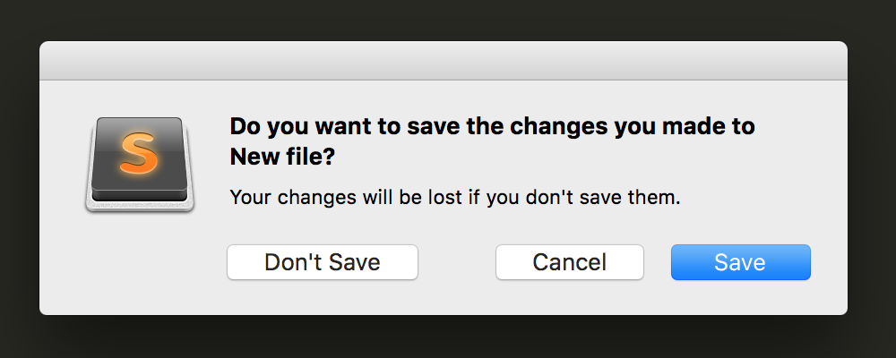
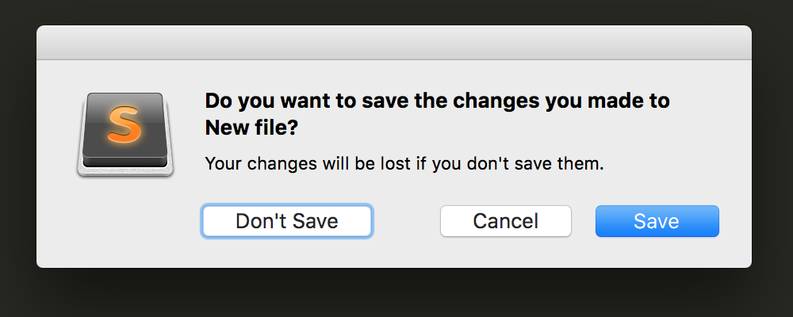

# 强迫症的 Mac 设置指南

## 如何配置一个高效的 Mac 工作环境

[English Version](https://github.com/macdao/ocds-guide-to-setting-up-mac/blob/master/README.en.md)

## Table of Contents

1. [OS X](#1-os-x)

   - [功能键](#功能键)
   - [全键盘控制](#全键盘控制)
   - [Spotlight 快捷键](#spotlight-快捷键)
   - [输入法快捷键](#输入法快捷键)
   - [其他快捷键](#其他快捷键)
   - [设置 Trackpad 轻点来点按](#设置-trackpad-轻点来点按)
   - [语音](#语音)
   - [词典](#词典)
   - [Dock Position](#dock-position)
   - [更改 Caps Lock 键为 Control 键](#更改-caps-lock-键为-control-键)
   - [Remove all Dock icons[OCD]](#remove-all-dock-iconsocd)
   - [重置 Launchpad 上图标位置[OCD]](#重置-launchpad-上图标位置ocd)

2. [常用工具](#2-常用工具)

   - [Homebrew](#homebrew)
   - [Homebrew Cask](#homebrew-cask)
   - [iTerm2](#iterm2)
   - [Oh My Zsh](#oh-my-zsh)
   - [stow](#stow)
   - [Git 常用别名](#git-常用别名)
   - [Scroll Reverser](#scroll-reverser)
   - [ShiftIt](#shiftit)
   - [Sublime Text 2](#sublime-text-2)
   - [MacDown](#macdown)
   - [z](#z)
   - [Vimium](#vimium)
   - [LastPass](#lastpass)
   - [SourceTree](#sourcetree)
   - [CheatSheet](#cheatsheet)
   - [Alfred](#alfred)

3. [开发工具](#3-开发工具)

   - [Java](#java)
   - [jEnv](#jenv)
   - [Java[OCD]](#javaocd)
   - [IntelliJ IDEA](#intellij-idea)
   - [rbenv](#rbenv)
   - [Ruby 常用别名](#ruby-常用别名)

一直想写这么一篇文章，把我从同事那里学到的经验分享出来。市面上有很多类似的文章，写得都非常好，让我受益匪浅。不过我还是有一些自己总结出来的经验想要分享。

在工作中，我一般会在 1 到 10 人的团队中，经常会结对编程，即两个人共用一台 Mac 工作，因此也经常会把 Mac 外接一个大显示器、鼠标和键盘。我的常用开发平台有 Java、Ruby、Node.js、Web 等，使用 [JetBrains](https://www.jetbrains.com/) 的开发工具，比如 IntelliJ IDEA、RubyMine、WebStorm 等。

我深知自己的知识有限，所以写下本文以便和大家切磋交流。同时更有效率的方法和更好的工具也在不断涌现，我也贪心的希望把更好的方法和工具都收集更到到这里，我会不断更新本文，让它尽量不过时。最新内容请访问：<https://github.com/macdao/ocds-guide-to-setting-up-mac>。欢迎通过 GitHub 的`Issues`或者直接`Pull Requests`方式来分享你的经验。期待你的反馈。

我认为“一个高效的 Mac 工作环境”有以下几个特点：

- 自动化

  举个例子。手动安装一个应用，需要1)打开浏览器，2)搜索应用的名字，3)打开应用网站，4)寻找下载链接和安装方法，5)下载并等待下载完成，6)安装下载文件，7)可能还有后续的安装步骤。而自动化安装一个应用，只需要1)打开终端工具，2)敲入安装命令，3)等待完成这几个步骤。

  自动化可以大大简化操作，提高效率。

- 统一

  我经常结对编程，偶尔会遇到快捷键不一样，命令不同等问题。我强烈建议，至少在一个团队中，大家尽量使用相同的快捷键、命令等环境。（我记得有个实践就是这个，可是我一直没找到该实践的名字和出处，求告诉）

- 够用

  够用就好，如果系统本身已经满足了我的需求，我不会再使用第三方工具。

- 效率

  效率，一切都是为了效率。

本文对于第三方应用如何安装和使用只有最简单的介绍，具体还请参考官方网站和相关文档。

有些章节标题标注了[OCD]，意思是这些章节带有我强烈的个人色彩，如果你跟我臭味相投，欢迎借鉴，如果你并不认同，请忽略掉好了。

PS：虽然本文名为“强迫症”，但其实并不是[真正意义上的强迫症](https://zh.wikipedia.org/wiki/强迫症)，真正意义上的强迫症是一种会对患者的日常生活产生负面影响的疾病。

## 1. OS X

本节介绍操作系统本身的一些设置。

### 功能键

默认情况下，F1-F12 都是特殊功能，比如调节屏幕亮度。而当你需要键入 F1-F12 时（比如在使用 IntelliJ IDEA 的快捷键时），需要同时按住 Fn。这对于开发人员来说是非常不方便的。

把 F1-F12 改成标准功能键：选择`System Preferences` > `Keyboard`，在`Keyboard`标签页中选中`Use all F1, F2, etc. keys as standard function keys`。

### 全键盘控制

当你在 Sublime Text 里关闭文件时，可能会遇到这样的对话框：



注意这个`Save`按钮跟其他两个按钮不太一样，它的底色是蓝的。这种按钮被称为默认按钮，除了用鼠标点击触发外，还可以通过回车键触发。

那么问题来了，如果你不想保存，想点击`Don't Save`，是不是只能用鼠标点击了呢？

并不是这样：选择`System Preferences` > `Keyboard`，在`Shortcuts`标签页中选择`All controls`；或者使用快捷键`⌃F7`。之后这个对话框会变成这样：



这个`Don't Save`按钮有了一圈蓝边，这个意味着你可以通过空格键触发。不仅如此，你还可以用`Tab`键把蓝边转移到其他按钮，来实现全键盘控制。

除了`All controls`这个方法，你还可以用`⌘⌫`来选择`Don't Save`。`⌘⌫`的作用是在包含“删除”或“不存储”按钮的对话框中选择“删除”或“不存储”。

除了上述两个办法之外，居然还有个方法！就是按`⌘D`！据说是因为按`⌘+按钮的大写首字母`可以触发该按钮。可是！我按了`⌘C`和`⌘S`想取消和保存都没用！但是`⌘D`真的有用！如果仅仅是这也就算了，可是我又手贱试了下 TextEdit，在关闭未保存的文件时弹出的对话框上有三个按钮`Delete`、`Cancel`和`Save`。然而`⌘D`和`⌘C`都没用，但是！`⌘S`可以保存！我完全不能理解！我整个人几乎都是崩溃的，只好以咆哮体写下这段文字。如果谁能解释请务必告诉我，必有重谢！

`⌘C`不能用应该是因为它绑定到了复制功能；而`⌘D`不能用因为它的作用是从“打开”对话框或“存储”对话框中选择“桌面”文件夹。

在这个对话框上，你可以用`Esc`来执行`Cancel`操作。

### Spotlight 快捷键

中文版 OS X 的 Spotlight 的快捷键是`⌃Space`。这个快捷键有一些问题：

- JetBrains 的 IDE，比如 IntelliJ IDEA、WebStorm 等都使用`⌃Space`作为自动完成这个最常用功能的快捷键。我不建议更改 IDE 的快捷键，而建议更改 Spotlight 的快捷键。
- 对于没有添加中文输入法的 Mac 来说，Spotlight 的快捷键是`⌘Space`。英语国家的人都是这样的。所以我建议把 Spotlight 的快捷键设置为`⌘Space`，跟他们一致。

### 输入法快捷键

一般来说切换输入法的快捷键是`⌘Space`。由于我建议把 Spotlight 的快捷键设置为`⌘Space`，所以我建议把切换输入法的快捷键设置为`⌥Space`。

### 其他快捷键

让双手尽量多的键盘和快捷键，少使用鼠标和触摸板，可以大大提高效率。

- [Mac keyboard shortcts](https://support.apple.com/kb/HT201236)

  苹果官方文档。当你在写代码，怎么通过快捷键让光标转移到行首、行尾、向上翻页或者将光标移左移一个词？都在这篇文档里。
  
- [Mac keyboard shortcuts for accessibility features](https://support.apple.com/kb/HT204434)

  苹果官方文档。回车触发蓝底按钮，空格触发蓝边按钮，都出自这里。

### 设置 Trackpad 轻点来点按

默认情况下按下触摸板才是点按（click）。我喜欢设置成用轻点作为点按：

选择`System Preferences` > `Trackpad`，在`Point & Click`标签页中选中`Tap to click`。

### 语音

OS X 自带了语音功能，可以用`say`命令让 Mac 开口说话：

```sh
say hello
```

可以和`&&`或者`;`配合使用来提示你某任务已经完成：

```sh
brew update && brew upgrade && brew cleanup ; say mission complete
```

通过命令行来听取发音还是有点麻烦。其实我们几乎可以在任何地方选中单词，然后使用快捷键`⌥+ESC`发音。仅仅需要这样设置一下：选择`System Preferences` > `Dictation & Speech`，在`Text to Speech`标签页中选中`Speak selected text when the key is pressed`。

### 词典

OS X 自带了词典（Dictionary）。你几乎可以在任何应用中通过三指轻拍触摸板来现实对应单词的释义。

也可以打开 Dictionary 应用来查找单词。

可以在 Dictionary 应用中添加英汉汉英词典。

### Dock Position

默认 Dock 在屏幕下方。我们的屏幕一般都是 16:10，Dock 在屏幕下方的话会占据本来就不大的垂直空间。建议把 Dock 放到左边或者右边。

### 更改 Caps Lock 键为 Control 键

我经常用到`Control`键，但这个键在键盘的左下角，很难按到。同时我发现我很少使用`Caps Lock`键，我一般会用`Shift`键加字母来输入大写字母，或者先输入小写再（通过快捷键）转换成大写。

基于以上原因，我把`Caps Lock`键的功能改成了`Control`键。很多同事也都这么做的，可能是受到 [HHKB](https://en.wikipedia.org/wiki/Happy_Hacking_Keyboard) 的影响。

设置方法：选择`System Preferences` > `Keyboard`，在`Keyboard`标签页中点击`Modifier Keys...`按钮，在弹出的窗口中，把`Caps Lock (⇪) Key:`对应的选项改成`⌃ Control`。

### Remove all Dock icons[OCD]

本条目对于强迫症适用。

默认情况下 Dock 被一堆系统自带的应用占据着，而其中大部分我都很少使用，当我打开几个常用应用后，Dock 上会有很多图标，每个图标都会被挤得很小。所以我会把所有 Dock 上固定的图标都删掉，这样一来 Dock 上只有我打开的应用。

PS：Finder 图标是删不掉的。

### 重置 Launchpad 上图标位置[OCD]

本条目对于强迫症适用。

新的应用被安装后，经常会跑到 Launchpad 的第一屏，所以它们的位置跟安装的顺序有关系，而我更希望它们可以按照某种更加稳定的顺序排列，比如按照系统默认的顺序：

```sh
defaults write com.apple.dock ResetLaunchPad -bool true; killall Dock
```

在默认顺序中，Launchpad 第一屏只有 Apple 自家应用。

## 2. 常用工具

本节介绍一些常用的，跟开发没有直接关系的第三方应用及其设置。

### [Homebrew](http://brew.sh)

包管理工具，官方称之为`The missing package manager for OS X`。

安装步骤见官网。

有了 brew 以后，要下载工具，比如 MySQL、Gradle、Maven、Node.js 等工具，就不需要去网上下载了，只要一行命令就能搞定：

```sh
brew install mysql gradle maven node
```

PS：安装 brew 的时候会自动下载和安装 Apple 的 Command Line Tools。

brew 的替代品有 [MacPorts](https://www.macports.org/)，现在基本没人用它。

### [Homebrew Cask](http://caskroom.io)

brew-cask 允许你使用命令行安装 OS X 应用。比如你可以这样安装 Chrome：`brew cask install google-chrome`。还有 Evernote、Skype、Sublime Text、VirtualBox 等都可以用 brew-cask 安装。

brew-cask 是社区驱动的，如果你发现 brew-cask 上的应用不是最新版本，或者缺少你某个应用，你可以自己提交 pull request。

安装：

```sh
brew install caskroom/cask/brew-cask
```

应用也可以通过 App Store 安装，而且有些应用只能通过 App Store 安装，比如 Xcode 等一些 Apple 的应用。App Store 没有对应的命令行工具，还需要 Apple ID。倒是更新起来很方便。

几乎所有常用的应用都可以通过 brew-cask 安装，而且是从应用的官网上下载，所以你要安装新的应用时，建议用 brew-cask 安装。如果你不知道应用在 brew-cask 中的 ID，可以先用`brew cask search`命令搜索。

### [iTerm2](https://www.iterm2.com/)

iTerm2 是最常用的终端应用，是 Terminal 应用的替代品。提供了诸如`Split Panes`等[一群实用特性](https://www.iterm2.com/features.html)。它默认的黑色背景让我毫不犹豫的抛弃了 Terminal。

安装：

```sh
brew cask install iterm2
```

感谢 brew-cask，我们可以通过命令行自动安装 iTerm2 了。

在终端里，除了可以用`⌃E`等快捷键（详见[其他快捷键](#其他快捷键)）之外，还可以使用`⌥B`、`⌥F`等快捷键（具体可以参考[这里](http://ss64.com/bash/syntax-keyboard.html)）。前提是这样设置一下：

选择`Iterm`菜单 > `Preferences` > `Profiles`，选择你在使用的 Profile（默认是`Default`），在`Keys`标签页中把`Left option (⌥) key acts as`和`Right option (⌥) key acts as`都设置成`+ESC`。

在打开新的窗口/标签页的时候，默认情况下新窗口总是 HOME 目录，还需要我每次敲命令才能进入工作目录。如果想要这个新窗口在打开的时候就自动进入工作目录，需要如下设置：

选择`Iterm`菜单 > `Preferences` > `Profiles`，选择你在使用的 Profile（默认是Default），在`General`标签页中的`Working Directory`部分中选择`Reuse previous seesion's directory`。

至此，Terminal 应用已经出色的完成了其历史使命。后面命令行就交给 iTerm2 啦。

在 iTerm2 中双击会自动选中对应的词，三击会选中对应的整行。选中的内容会自动进入剪贴板，不需要再按`⌘C`复制。

### [Oh My Zsh](http://ohmyz.sh)

默认的 Bash 是黑白的，没有色彩。而 Oh My Zsh 可以带你进入彩色时代。Oh My Zsh 同时提供一套插件和工具，可以简化命令行操作。后面我们会看到很多介绍，你会看到我爱死这家伙了。

安装方法见官网。

目前我使用的插件有：`git z sublime history rbenv bundler rake`

Oh My Zsh 使用了 Z shell（zsh），一个和 Bash 相似的 Shell，而非 Bash。

在 Z shell 中，`~/.zshrc`是最重要的配置文件。Oh My Zsh 在安装的时候会把当前环境的`$PATH`写入`~/.zshrc`中。这并不是我期望的行为，因为使用了 brew，我们基本不再需要去定制`$PATH`，而 Oh My Zsh 提供的默认`$PATH`值`$HOME/bin:/usr/local/bin:$PATH`是非常合适的一个值，它把`$HOME/bin`加入了`$PATH`，可以让我们把自己用的脚本放到`$HOME/bin`下。

所以建议把`~/.zshrc`重置：

```sh
cp ~/.oh-my-zsh/templates/zshrc.zsh-template ~/.zshrc
```

Oh My Zsh 还有很多[有价值的插件](https://github.com/robbyrussell/oh-my-zsh/wiki/Plugins-Overview)。

替代品有 [Oh My Fish](https://github.com/oh-my-fish/oh-my-fish)，使用了 [Fishshell](http://fishshell.com/) 作为基础。

### [Stow](http://www.gnu.org/software/stow/)
GNU stow 是管理符号链接（symlink）的一个小公举。主要用于 symlink 你的 [dotfiles](http://dotfiles.github.io/) 如 emacs，git，fish/zsh 的配置文件。安装只需要

```
brew install stow
```

安装了 stow 之后，我们可以开始 symlink 一些 dotfiles 了。完整使用 stow 和 dotfiles 的流程可以参考 <https://github.com/jcouyang/dotfiles>

当你的 dotfiles 都妥妥的 symlink 到 `~/dotfiles` 后，push 到 github 上就再也不怕换电脑了。

### Git 常用别名

几乎每个人都会使用一些方法比如 Git 别名来提高效率，几乎所有人都会把使用`git st`来代替`git status`。然而这需要手动设置，每个人也都不完全一样。

Oh My Zsh 提供了一套系统别名（alias），来达到相同的功能。比如`gst`作为`git status`的别名。而且 Git 插件是 Oh My Zsh 默认启用的，相当于你使用了 Oh My Zsh，你就拥有了一套高效率的别名，而且还是全球通用的。是不是棒棒哒？下面是一些我常用的别名：

Alias | Command
----- | -------
gapa  | `git add --patch`
gc!   | `git commit -v --amend`
gcl   | `git clone --recursive`
gclean| `git reset --hard && git clean -dfx`
gcm   | `git checkout master`
gcmsg | `git commit -m`
gco   | `git checkout`
gd    | `git diff`
gdca  | `git diff --cached`
glola | `git log --graph --pretty = format:'%Cred%h%Creset -%C(yellow)%d%Creset %s %Cgreen(%cr) %C(bold blue)<%an>%Creset' --abbrev-commit --all`
gp    | `git push`
grbc  | `git rebase --continue`
gst   | `git status`
gup   | `git pull --rebase`
gwip  | `git add -A; git rm $(git ls-files --deleted) 2> /dev/null; git commit -m "--wip--"`


完整列表请参考：<https://github.com/robbyrussell/oh-my-zsh/wiki/Plugin:git>


### Scroll Reverser

当你在浏览一个很长的网页时，你看完了当前显示的内容，想要看后续的内容，你可以在 Trackpad 上双指上滑，或者鼠标滚轮向上滚动。这是被称作“自然”的滚动方向。

然而在 Windows 里鼠标滚动的行为是相反的：鼠标滚轮向下滚动才会让浏览器显示后续的内容，向上滚动会达到页面的顶部。你可以在 OS X 的系统偏好设置里修改（选择`System Preferences` > `Trackpad`，在`Scroll & Zoom`标签页中不选中`Scroll direction: natural`），但是这样会同时改变鼠标滚轮的方向和 Trackpad 的方向。

要想只改变鼠标滚轮的方向，而保持 Trackpad 依旧是“自然”的，我们需要 Scroll Reverser：

```sh
brew cask install scroll-reverser
```

PS：这货会让三指点击失效

### ShiftIt

原生 OS X 下只能手动调整窗口大小，所以我们需要窗口管理工具。我用过很多窗口管理工具，可惜大部分工具都存在快捷键冲突的问题（对我来说主要是 IntelliJ IDEA）。ShiftIt 是少见的没有冲突的窗口管理工具：

```sh
brew cask install shiftit
```

PS：ShiftIt的旧版本需要安装 X11，最新版本已经修正了这个问题。

替代者有 SizeUp，主要快捷键和 ShiftIt 相同。

当然如果喜欢 hacking，[Slate](https://github.com/jigish/slate)  是个不错的 hackable 的窗口管理工具。配置可以参照 http://thume.ca/howto/2012/11/19/using-slate/

### Sublime Text 2

安装：

```sh
brew cask install sublime-text
```

在命令行中指定使用 Sublime Text 打开某文件，是一个非常常用的功能，一般我们会按照 [OS X Command Line](https://www.sublimetext.com/docs/2/osx_command_line.html) 中所说执行 `ln -s "/Applications/Sublime Text 2.app/Contents/SharedSupport/bin/subl" ~/bin/subl` 来增加`subl`链接。但是如果你用 brew-cask 安装的话，恭喜你，你不需要运行这个命令，因为 brew-cask 自动帮你做了这件事情。而且你卸载 Sublime Text 的时候 brew-cask 会自动删掉这个链接。

同时 Oh My Zsh 也提供了 Sublime Text 插件，叫做`sublime`。参考：<https://github.com/robbyrussell/oh-my-zsh/tree/master/plugins/sublime>，这个插件和通过 brew-cask 安装的 Sublime Text 完美兼容。

替代品有 Atom、TextMate、Sublime Text 3 等，跟 Sublime Text 2 一样，用 brew-cask 安装的话命令行工具会被自动加入`$PATH`。

### MacDown

MacDown 是 Markdown 编辑器。由于 Mou 一直不支持代码高亮，我就转向了 MacDown。完美支持 [GFM](https://help.github.com/articles/github-flavored-markdown/)。

我特别喜欢 [Markdown](https://daringfireball.net/projects/markdown/)，我用 Makdown 来写文章（包括本文），写幻灯片（[reveal.js](https://github.com/hakimel/reveal.js/)）。Markdown 可以让我专注于内容本身，而无需花精力在排版和样式上。

安装：

```sh
brew cask install macdown
```

### z

在打开终端后，你是怎么进入项目的工作目录？是`cd xxx`，`⌃R`还是用别名？

[z](https://github.com/rupa/z) 工具可以帮你快速进入目录。比如在我的 Mac 上运行`z cask`就会进入`/usr/local/Library/Taps/caskroom/homebrew-cask/Casks`目录。

这货的安装非常方便，甚至都不需要下载任何东西，因为它已经整合在了 Oh My Zsh 中。编辑`~/.zshrc`文件，在`plugins=(git)`这行中加上`z`变成`plugins=(git z)`，然后运行`source ~/.zshrc`重新加载配置文件，就可以使用 z 了。

替代品有 autojump。autojump 需要使用 brew 安装。

### [Vimium](https://vimium.github.io/)

Vimium 是一个 Google Chrome 扩展，让你可以纯键盘操作 Chrome，把你的 Chrome 变成“黑客的浏览器”。

安装方法请参考官方网站。

其他浏览器也有类似的工具，比如 FireFox 的 [KeySnail](https://github.com/mooz/keysnail)。

### [LastPass](https://lastpass.com)

LastPass 是管理密码的工具，支持二次验证，提供所有浏览器插件以及 Mac 桌面版本。

最重要的是，它提供 **命令行** 的版本，可以直接通过 brew 安装

```sh
brew install lastpass-cli --with-pinentry
```

之后，只需要登陆：

```sh
lpass login you@email.com
```

就可以拷贝密码或者集成到其他命令中了：

```sh
lpass show --password gmail.com -c
```

### [SourceTree](https://www.sourcetreeapp.com/)

SourceTree 是 Atlassian 公司出品的一款优秀的 Git 图形化客户端。如果你发现命令行无法满足你的要求，可以试试 SourceTree。

安装：

```sh
brew cask install sourcetree
```

用 brew-cask 安装会自动增加命令行工具`stree`到`$PATH`里。在命令行中输入`stree`可以快速用 SourceTree 打开当前 Git 仓库。详细用法请参见`stree --help`。

### [CheatSheet](http://www.mediaatelier.com/CheatSheet/)

CheatSheet 能够显示当前程序的快捷键列表，默认的快捷键是长按`⌘`。


安装：

```sh
brew cask install cheatsheet
```

### [Alfred](https://www.alfredapp.com)

Mac 用户不用鼠标键盘的必备神器，配合大量 Workflows，习惯之后可以大大减少操作时间。

上手简单，调教成本在后期自定义 Workflows，不过有大量雷锋使用者提供的现成扩展，访问[这里](http://www.alfredworkflow.com/)挑选喜欢的，并可以极其简单地根据自己的需要修改。

安装：

```sh
brew cask install alfred
```

## 3. 开发工具

### Java

现在 OS X 都不会自带 JDK 了，所以进行 Java 开发的话，需要下载 JDK。在 brew-cask 之前，我们需要从 <https://developer.apple.com/downloads/> 或者 Oracle 网站上下载。还有更麻烦的－－卸载 JDK 和升级 JDK。

JDK 安装文件是 pkg 格式，卸载和`.app`不一样，且没有自动卸载方式。

而 brew-cask 提供了自动安装和卸载功能，能够自动从官网上下载并安装 JDK 8。

```sh
brew cask install java
```

如果你需要安装 JDK 7 或者 JDK 6，可以使用`homebrew-cask-versions`：

```sh
brew tap caskroom/versions
brew cask install java6
```

在 OS X 上，你可以同时安装多个版本的 JDK。你可以通过命令`/usr/libexec/java_home -V`来查看安装了哪几个 JDK。

那问题来了，当你运行`java`或者 Java 程序时使用的是哪个 JDK 呢？在 OS X 下，`java`也就是`/usr/bin/java`在默认情况下指向的是已经安装的最新版本。但是你可以设置环境变量`JAVA_HOME`来更改其指向：

```sh
$ java -version
java version "1.8.0_60"
Java(TM) SE Runtime Environment (build 1.8.0_60-b27)
Java HotSpot(TM) 64-Bit Server VM (build 25.60-b23, mixed mode)
$ JAVA_HOME=/Library/Java/JavaVirtualMachines/1.6.0.jdk/Contents/Home java -version
java version "1.6.0_65"
Java(TM) SE Runtime Environment (build 1.6.0_65-b14-466.1-11M4716)
Java HotSpot(TM) 64-Bit Server VM (build 20.65-b04-466.1, mixed mode)
```

其中`JAVA_HOME=/Library/Java/JavaVirtualMachines/1.6.0.jdk/Contents/Home`可以用`` JAVA_HOME=`/usr/libexec/java_home -v 1.6` ``这种更加通用的方式代替。

### [jEnv](https://github.com/gcuisinier/jenv)

也可以使用 jEnv 来管理不同版本的 JDK，这个工具跟 [rbenv](#rbenv) 类似，通过当前目录下的`.java-version`来决定使用哪个 JDK。jEnv 也可以用 brew 安装。不过要使用 jEnv 要有几个问题：

- 需要手动把`eval "$(jenv init -)"`加入 profile，没有 Oh My Zsh 插件。这点是我非常反感的。

  可以把`eval "$(jenv init -)"`加入`~/.zlogin`，这样可以避免修改`~/.zshrc`。
- 需要手动添加 JDK，不会自动采集系统 JDK。跟 Ruby 不同，OS X 已经提供`/usr/libexec/java_home`工具来管理安装的 JDK。
- 需要 `jenv rehash`。这个是跟 rbenv 学的。

所以我建议不要使用 jEnv。

### Java[OCD]

作为一个强迫症患者，每当我看到 Java 的错误写法就想纠正过来。

当指编程语言时，Java 的正确写法是首字母大写，其余小写。其他写法比如`JAVA`、`java`都是不对的。

在其他一些地方会使用小写的`java`：

- `java`命令
- 原文件`Main.java`
- 包名`java.lang`

只有在全大写的标题里使用`JAVA`或者环境变量`JAVA_HOME`。

### IntelliJ IDEA

Java 开发必备工具 IntelliJ IDEA。可以安装 Ultimate Edition：

```sh
brew cask install intellij-idea
```

也可以安装开源免费的 Community Edition：

```sh
brew cask install intellij-idea-ce
```

IntelliJ IDEA 有几套内建的快捷键方案（Keymap）。其中适用于 OS X 的有`Mac OS X`和`Mac OS X 10.5+`两种。区别是:

- `Mac OS X`方案和其他平台上的快捷键类似，
- 而`Mac OS X 10.5+`更加符合 OS X 常用的快捷键。

一个团队使用不同的快捷键会严重影响效率。可以用`View | Quick Switch Scheme`（`⌃ Back Quote`）快速切换 Keymap。

如果可以选择的话，我建议使用`Mac OS X`方案。因为我经常遇到使用 Windows 的客户，而 Windows 平台上的快捷键和`Mac OS X`方案类似。

可以从 IDEA 的`Help > Default Keymap Reference`打开快捷键的参考手册。不过从这里打开的是`Mac OS X 10.5+`方案的，而`Mac OS X`方案的可以从这里找到：<http://www.basrikahveci.com/static/ij_keymap_mac.pdf>。

### [rbenv](https://github.com/sstephenson/rbenv)

人人都需要一个 Ruby 版本管理工具。rbenv 就是这样一个轻量级工具，它可以通过 brew 安装。

安装：

```sh
brew install rbenv ruby-build
```

然后在`~/.zshrc`中加上`rbenv`插件。否则你需要手动添加`eval "$(rbenv init -)"`到`~/zshrc`或者`~/.zprofile`文件里。

有时候项目会依赖一些奇怪的版本号，比如`ruby-2.1.0`，这个时候你需要 [rbenv-aliases](https://github.com/tpope/rbenv-aliases) 帮忙：

```sh
brew install rbenv-aliases
```

替代品有 RVM、chruby。因为 RVM 不能通过 brew 安装，并且安装的时候会没有节操的修改一堆文件，所以被我早早的弃用了。chruby 也是一个轻量级工具，而且可以完美的和 Oh My Zsh 集成在一起，我看到有些生产环境在用它。

### Ruby 常用别名

几乎所有 Ruby 开发人员都会把`bi`作为`bundle install`的别名。Oh My Zsh 提供`builder`插件，这个插件提供了一套别名，比如`bi`、`be`。同时还能让你在运行一些常用 gem 的时候直接输入`rspec`，不需要`be rspec`这样了。具体包括哪些命令请参考[这里](https://github.com/robbyrussell/oh-my-zsh/tree/master/plugins/bundler)。

Z shell 对于`[`和`]`符号有特殊的处理，所以在运行`rake task[parameter]`的时候会报错，你需要改成`rake task\[parameter\]`或者`noglob rake task[parameter]`。然而 Oh My Zsh 已经看穿这一切，自带的 rake 插件已经解决了这个问题：`brake task[parameter]`。

添加插件的时候注意把`rake`放到`bundler`后面，例如这样：

```
plugins=(git z sublime history rbenv bundler rake)
```

## 参考资料

- [Hacker's Guide to Setting up Your Mac](http://lapwinglabs.com/blog/hacker-guide-to-setting-up-your-mac)
- [Setting up a new (OS X) development machine](https://mattstauffer.co/blog/setting-up-a-new-os-x-development-machine-part-1-core-files-and-custom-shell)
- [高效 MacBook 工作环境配置](http://www.xialeizhou.com/?p=71)
- [程序员如何优雅地使用 Mac？](http://www.zhihu.com/question/20873070)
